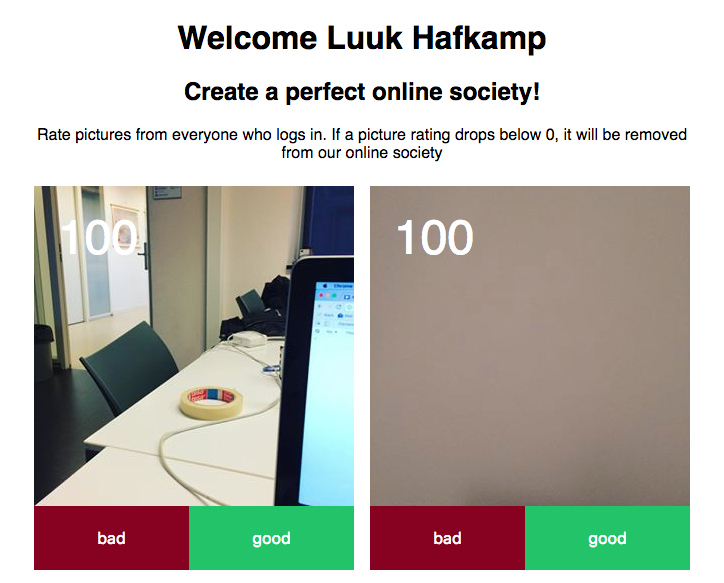

<h1 align="center">
  
  <br>
  <br>
  Rating pics with Instagram
</h1>

## Live version
<a href="https://murmuring-retreat-41407.herokuapp.com">Live demo here</a>

## Features
-  [x] the app remembers who you are by using <a href="https://www.mongodb.com/">MongoDB</a>!
-  [x] adding Instagram pictures real-time using <a href="https://socket.io/">socket.io</a> everytime you make a picture!
-  [x] delete pictures from anyone you want, make some enemies!
  
## Build
To run the application:
```bash
git clone
```

In order to get this app working you need to fill in the following <a href="https://www.npmjs.com/package/dotenv">dotenv</a> variables:  

```bash
CLIENT_ID={your client id here}
```  
```bash
CLIENT_SECRET={your client secret here}
```  
```bash
REDIRECT_URI={your redirect uri here}
```  

You can receive theses variables by making a new "Sandbox" on the Instagram development site:  
<a href="https://www.instagram.com/developer/authentication/">https://www.instagram.com/developer/authentication/</a>  
  
Now you only have to make sure to pass in your <a href="https://www.mongodb.com/">MongoDB</a> database. Simply place your database link inside the mongoose.connect braces:

```javascript
mongoose.connect({your link here});
```  

<br>
Finally, to use the app you need to run the following commands:  
```bash
npm install
```
To install the Node dependencies.
```bash
npm start
```  
To start the server.

## TODO
-  [x] getting the oauth to work
-  [x] saving images to the database
-  [x] showing individual users from the database
-  [x] add a judge-system which blurs out bad pictures
-  [ ] one like per user
-  [ ] styling

## Wishlist
-  [ ] loading indicator for new images
-  [ ] profile pages where you can check how your photo's are holding up
-  [ ] categories
